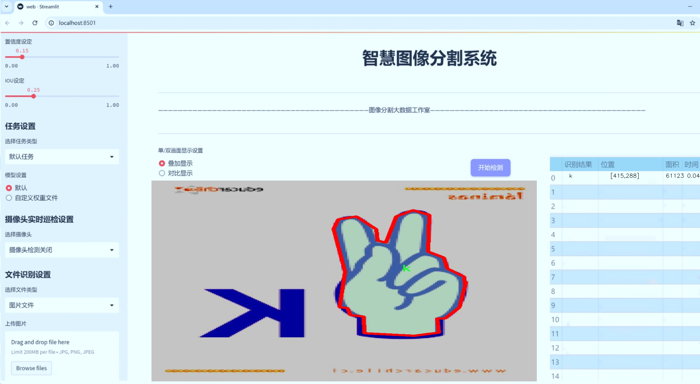
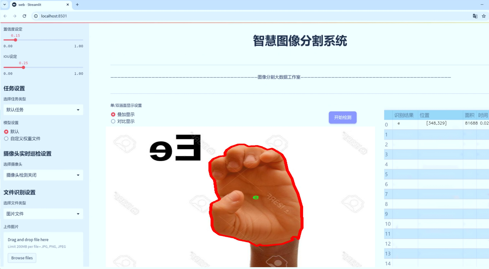
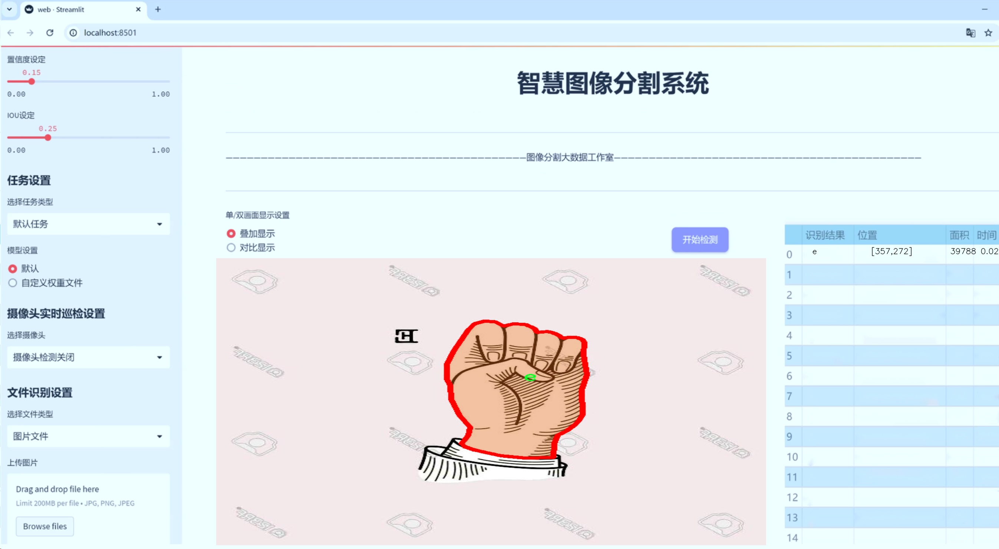
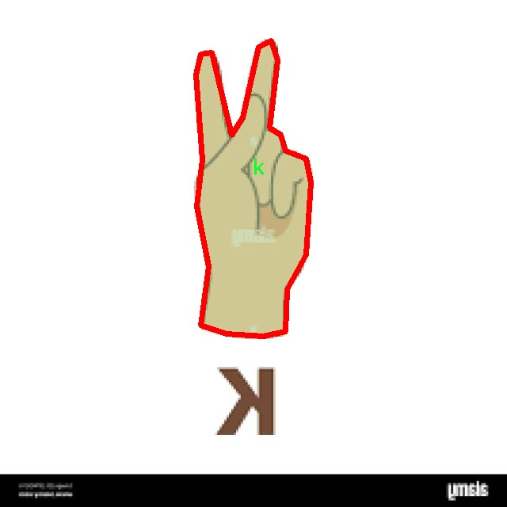
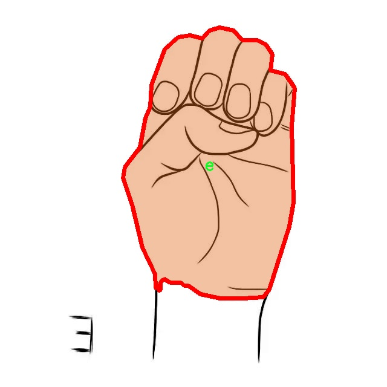
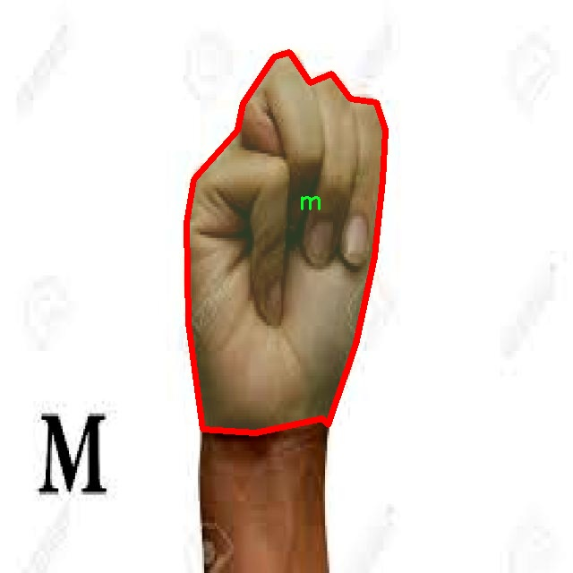

# 哥伦比亚手语分割系统源码＆数据集分享
 [yolov8-seg-AFPN-P345＆yolov8-seg-RCSOSA等50+全套改进创新点发刊_一键训练教程_Web前端展示]

### 1.研究背景与意义

项目参考[ILSVRC ImageNet Large Scale Visual Recognition Challenge](https://gitee.com/YOLOv8_YOLOv11_Segmentation_Studio/projects)

项目来源[AAAI Global Al lnnovation Contest](https://kdocs.cn/l/cszuIiCKVNis)

研究背景与意义

随着信息技术的迅猛发展，人工智能在各个领域的应用日益广泛，尤其是在计算机视觉和自然语言处理领域。手语作为一种重要的交流方式，尤其在聋哑人群体中扮演着不可或缺的角色。然而，由于手语的表达方式与口语存在显著差异，传统的语音识别和文本翻译技术难以满足手语翻译的需求。因此，基于计算机视觉的手语识别与分割技术应运而生，成为提升聋哑人群体沟通能力的重要工具。

在这一背景下，哥伦比亚手语（Lengua de Señas Colombiana, LSC）的研究尤为重要。LSC作为哥伦比亚的官方手语，其独特的手势和符号体系不仅承载着丰富的文化内涵，也反映了当地的社会习俗和语言特征。尽管已有一些研究致力于手语识别，但针对哥伦比亚手语的系统化研究仍然相对较少。因此，构建一个高效、准确的哥伦比亚手语分割系统具有重要的学术价值和社会意义。

本研究基于改进的YOLOv8模型，旨在实现对哥伦比亚手语的实例分割。YOLO（You Only Look Once）系列模型因其高效的实时检测能力而广泛应用于目标检测领域。通过对YOLOv8进行改进，能够更好地适应手语分割的需求，提升模型在复杂背景下的分割精度和速度。本研究所使用的数据集包含1600张图像，涵盖21个手语类别，包括字母a到y。这一数据集的构建为手语识别提供了丰富的样本支持，能够有效训练和验证模型的性能。

手语分割系统的构建不仅有助于提高手语识别的准确性，还能为后续的手语翻译、教育和人机交互等应用奠定基础。通过将手语转化为可视化的信息，能够有效促进聋哑人与社会的沟通，提升他们的生活质量。此外，手语识别技术的进步也将推动相关领域的研究，如智能家居、虚拟助手等，使得这些技术能够更好地服务于不同的用户群体。

综上所述，基于改进YOLOv8的哥伦比亚手语分割系统的研究，不仅具有重要的理论意义，也具备广泛的应用前景。通过这一研究，期望能够填补哥伦比亚手语研究领域的空白，推动手语识别技术的发展，为聋哑人群体的沟通提供更为有效的解决方案。未来，随着技术的不断进步和数据集的不断丰富，手语识别系统有望在更大范围内得到应用，助力实现无障碍沟通的理想目标。

### 2.图片演示







##### 注意：由于此博客编辑较早，上面“2.图片演示”和“3.视频演示”展示的系统图片或者视频可能为老版本，新版本在老版本的基础上升级如下：（实际效果以升级的新版本为准）

  （1）适配了YOLOV8的“目标检测”模型和“实例分割”模型，通过加载相应的权重（.pt）文件即可自适应加载模型。

  （2）支持“图片识别”、“视频识别”、“摄像头实时识别”三种识别模式。

  （3）支持“图片识别”、“视频识别”、“摄像头实时识别”三种识别结果保存导出，解决手动导出（容易卡顿出现爆内存）存在的问题，识别完自动保存结果并导出到tempDir中。

  （4）支持Web前端系统中的标题、背景图等自定义修改，后面提供修改教程。

  另外本项目提供训练的数据集和训练教程,暂不提供权重文件（best.pt）,需要您按照教程进行训练后实现图片演示和Web前端界面演示的效果。

### 3.视频演示

[3.1 视频演示](https://www.bilibili.com/video/BV1SH2cY6Ecv/)

### 4.数据集信息展示

##### 4.1 本项目数据集详细数据（类别数＆类别名）

nc: 21
names: ['a', 'b', 'c', 'd', 'e', 'f', 'i', 'k', 'l', 'm', 'n', 'o', 'p', 'q', 'r', 't', 'u', 'v', 'w', 'x', 'y']


##### 4.2 本项目数据集信息介绍

数据集信息展示

在本研究中，我们使用了名为“LenguaSenasColombiana”的数据集，以训练和改进YOLOv8-seg模型，旨在实现高效的哥伦比亚手语分割系统。该数据集专门针对哥伦比亚手语的特征进行构建，涵盖了21个不同的手语类别。这些类别分别为：'a', 'b', 'c', 'd', 'e', 'f', 'i', 'k', 'l', 'm', 'n', 'o', 'p', 'q', 'r', 't', 'u', 'v', 'w', 'x', 'y'。每个类别代表了哥伦比亚手语中的一个基本手势，构成了该语言的基础词汇。

数据集的设计充分考虑了手语的多样性和复杂性。每个手势在不同的背景、光照条件和手部姿态下均进行了采集，以确保模型在实际应用中的鲁棒性和准确性。数据集中包含了大量的图像和视频数据，这些数据通过专业的手语使用者进行标注，确保了每个手势的准确性和一致性。为了提高模型的泛化能力，数据集还包括了不同年龄、性别和肤色的手语使用者，反映了哥伦比亚社会的多样性。

在数据预处理阶段，我们对图像进行了标准化处理，包括尺寸调整、颜色空间转换和数据增强等。这些步骤旨在提高模型的训练效率和分割精度。此外，数据集中还提供了详细的标注信息，包括每个手势的边界框和分割掩码，便于YOLOv8-seg模型进行有效的学习和推理。

在训练过程中，我们采用了交叉验证的方法，以评估模型在不同数据子集上的表现。这种方法不仅能够帮助我们识别模型的潜在过拟合问题，还能为模型的调优提供重要的反馈。通过不断调整超参数和网络结构，我们力求在手势识别的准确性和实时性之间找到最佳平衡。

值得一提的是，哥伦比亚手语作为一种视觉语言，其表达方式与口语有着显著的不同。因此，在模型训练中，我们特别关注手势的动态特征和时序信息。这使得我们不仅能够识别静态手势，还能有效捕捉手势的变化过程，从而提高模型在实际应用中的实用性。

总之，“LenguaSenasColombiana”数据集为我们提供了一个丰富的资源，以支持YOLOv8-seg模型在哥伦比亚手语分割任务中的训练与评估。通过充分利用这一数据集，我们期望能够推动手语识别技术的发展，为听障人士提供更为便捷的沟通工具，并促进社会对手语文化的理解与尊重。随着研究的深入，我们相信这一系统将在未来的应用中展现出巨大的潜力和价值。








### 5.全套项目环境部署视频教程（零基础手把手教学）

[5.1 环境部署教程链接（零基础手把手教学）](https://www.bilibili.com/video/BV1jG4Ve4E9t/?vd_source=bc9aec86d164b67a7004b996143742dc)


[5.2 安装Python虚拟环境创建和依赖库安装视频教程链接（零基础手把手教学）](https://www.bilibili.com/video/BV1nA4VeYEze/?vd_source=bc9aec86d164b67a7004b996143742dc)

### 6.手把手YOLOV8-seg训练视频教程（零基础小白有手就能学会）

[6.1 手把手YOLOV8-seg训练视频教程（零基础小白有手就能学会）](https://www.bilibili.com/video/BV1cA4VeYETe/?vd_source=bc9aec86d164b67a7004b996143742dc)


按照上面的训练视频教程链接加载项目提供的数据集，运行train.py即可开始训练



     Epoch   gpu_mem       box       obj       cls    labels  img_size
     1/200     0G   0.01576   0.01955  0.007536        22      1280: 100%|██████████| 849/849 [14:42<00:00,  1.04s/it]
               Class     Images     Labels          P          R     mAP@.5 mAP@.5:.95: 100%|██████████| 213/213 [01:14<00:00,  2.87it/s]
                 all       3395      17314      0.994      0.957      0.0957      0.0843

     Epoch   gpu_mem       box       obj       cls    labels  img_size
     2/200     0G   0.01578   0.01923  0.007006        22      1280: 100%|██████████| 849/849 [14:44<00:00,  1.04s/it]
               Class     Images     Labels          P          R     mAP@.5 mAP@.5:.95: 100%|██████████| 213/213 [01:12<00:00,  2.95it/s]
                 all       3395      17314      0.996      0.956      0.0957      0.0845

     Epoch   gpu_mem       box       obj       cls    labels  img_size
     3/200     0G   0.01561    0.0191  0.006895        27      1280: 100%|██████████| 849/849 [10:56<00:00,  1.29it/s]
               Class     Images     Labels          P          R     mAP@.5 mAP@.5:.95: 100%|███████   | 187/213 [00:52<00:00,  4.04it/s]
                 all       3395      17314      0.996      0.957      0.0957      0.0845


### 7.50+种全套YOLOV8-seg创新点代码加载调参视频教程（一键加载写好的改进模型的配置文件）

[7.1 50+种全套YOLOV8-seg创新点代码加载调参视频教程（一键加载写好的改进模型的配置文件）](https://www.bilibili.com/video/BV1Hw4VePEXv/?vd_source=bc9aec86d164b67a7004b996143742dc)

### 8.YOLOV8-seg图像分割算法原理

原始YOLOv8-seg算法原理

YOLOv8-seg算法是YOLO系列模型的最新进展，标志着计算机视觉领域在目标检测和实例分割任务上的又一次重大突破。自2023年1月10日发布以来，YOLOv8凭借其卓越的性能和高效的计算能力，迅速成为学术界和工业界的研究热点。YOLOv8-seg不仅继承了前代模型的优点，还在多个方面进行了创新和改进，使其在精度和速度上均优于现有的检测和分割模型。

YOLOv8的架构主要由输入层、主干网络（Backbone）、颈部网络（Neck）和头部网络（Head）四个部分组成。输入层负责将原始图像调整为指定的输入尺寸，以适应后续的处理需求。主干网络采用了CSPDarknet结构，利用卷积操作对输入图像进行特征提取。与YOLOv5相比，YOLOv8引入了C2f模块，取代了C3模块。C2f模块通过将输入特征图分成两个分支并进行降维处理，增强了模型的特征提取能力和梯度流动性。这种设计使得模型能够更好地捕捉到复杂的特征信息，从而提高了检测的准确性。

在特征提取的过程中，YOLOv8还引入了快速空间金字塔池化（SPPF）结构，旨在提取不同尺度的特征。SPPF通过多个最大池化层的组合，有效地减少了模型的参数量和计算量，同时提升了特征提取的效率。这一创新使得YOLOv8在处理多尺度目标时表现得更加出色，能够在复杂场景中准确识别出目标。

颈部网络部分则采用了特征金字塔网络（FPN）和路径聚合网络（PAN）的结合，旨在融合来自不同尺度的特征图信息。通过多层卷积和池化操作，颈部网络能够有效地处理和压缩特征图，将其传递给头部网络进行最终的目标检测和分割。这种结构不仅提高了特征的表达能力，还增强了模型对小目标的检测能力，使得YOLOv8在实际应用中能够处理更多复杂的场景。

YOLOv8的头部网络是其最大的创新之一，采用了解耦的检测头设计。与传统的锚框（Anchor-Based）方法不同，YOLOv8采用了无锚框（Anchor-Free）的检测方式，直接预测目标的中心点和宽高比例。这一改变显著减少了锚框的数量，提升了检测速度和准确度。同时，解耦的检测头通过两个并行的卷积分支分别计算回归和类别的损失，使得模型在训练过程中能够更好地优化各自的目标，从而提高整体性能。

在损失函数的设计上，YOLOv8也进行了创新，采用了一种新的损失函数来优化模型的训练过程。这一损失函数不仅考虑了目标的分类和回归损失，还引入了额外的约束，以确保模型在处理复杂场景时的稳定性和准确性。这种综合性的损失设计，使得YOLOv8在多种任务中都能表现出色，尤其是在实例分割任务中，能够准确地分割出不同的目标。

此外，YOLOv8还特别针对小目标检测和高分辨率图像处理进行了优化。通过调整模型结构和参数设置，YOLOv8能够在保持高精度的同时，有效地处理小目标，提升了模型在实际应用中的适用性。这一特性使得YOLOv8在许多需要高精度检测的领域，如自动驾驶、安防监控和医学影像分析等，展现出了广泛的应用前景。

综上所述，YOLOv8-seg算法通过对主干网络、颈部网络和头部网络的全面改进，结合无锚框检测和创新的损失函数设计，极大地提升了目标检测和实例分割的性能。其高效的特征提取能力、灵活的网络结构以及出色的处理速度，使得YOLOv8在计算机视觉领域中树立了新的标杆，成为当前最先进的目标检测和分割模型之一。随着YOLOv8的广泛应用，未来在更多实际场景中的表现值得期待。


### 9.系统功能展示（检测对象为举例，实际内容以本项目数据集为准）

图9.1.系统支持检测结果表格显示

  图9.2.系统支持置信度和IOU阈值手动调节

  图9.3.系统支持自定义加载权重文件best.pt(需要你通过步骤5中训练获得)

  图9.4.系统支持摄像头实时识别

  图9.5.系统支持图片识别

  图9.6.系统支持视频识别

  图9.7.系统支持识别结果文件自动保存

  图9.8.系统支持Excel导出检测结果数据


### 10.50+种全套YOLOV8-seg创新点原理讲解（非科班也可以轻松写刊发刊，V11版本正在科研待更新）

#### 10.1 由于篇幅限制，每个创新点的具体原理讲解就不一一展开，具体见下列网址中的创新点对应子项目的技术原理博客网址【Blog】：


[10.1 50+种全套YOLOV8-seg创新点原理讲解链接](https://gitee.com/qunmasj/good)

#### 10.2 部分改进模块原理讲解(完整的改进原理见上图和技术博客链接)【此小节的图要是加载失败请移步原始博客查看，链接：https://blog.csdn.net/cheng2333333?type=blog】

### YOLOv8简介
YoloV8模型结构
YOLOv3之前的所有YOLO对象检测模型都是用C语言编写的，并使用了Darknet框架，Ultralytics发布了第一个使用PyTorch框架实现的YOLO (YOLOv3)；YOLOv3之后，Ultralytics发布了YOLOv5，在2023年1月，Ultralytics发布了YOLOv8，包含五个模型，用于检测、分割和分类。 YOLOv8 Nano是其中最快和最小的，而YOLOv8 Extra Large (YOLOv8x)是其中最准确但最慢的，具体模型见后续的图。

YOLOv8附带以下预训练模型:

目标检测在图像分辨率为640的COCO检测数据集上进行训练。
实例分割在图像分辨率为640的COCO分割数据集上训练。
图像分类模型在ImageNet数据集上预训练，图像分辨率为224。
YOLOv8 概述
具体到 YOLOv8 算法，其核心特性和改动可以归结为如下：

提供了一个全新的SOTA模型（state-of-the-art model），包括 P5 640 和 P6 1280 分辨率的目标检测网络和基于YOLACT的实例分割模型。和 YOLOv5 一样，基于缩放系数也提供了 N/S/M/L/X 尺度的不同大小模型，用于满足不同场景需求
骨干网络和 Neck 部分可能参考了 YOLOv7 ELAN 设计思想，将 YOLOv5 的 C3 结构换成了梯度流更丰富的 C2f 结构，并对不同尺度模型调整了不同的通道数，属于对模型结构精心微调，不再是一套参数应用所有模型，大幅提升了模型性能。
Head 部分相比 YOLOv5 改动较大，换成了目前主流的解耦头结构，将分类和检测头分离，同时也从Anchor-Based 换成了 Anchor-Free
Loss 计算方面采用了TaskAlignedAssigner正样本分配策略，并引入了Distribution Focal Loss
训练的数据增强部分引入了 YOLOX 中的最后 10 epoch 关闭 Mosiac 增强的操作，可以有效地提升精度


### HRNet V2简介
现在设计高低分辨率融合的思路主要有以下四种：


（a）对称结构。如U-Net、Hourglass等，都是先下采样再上采样，上下采样过程对称。

（b）级联金字塔。如refinenet等，高低分辨率融合时经过卷积处理。

（c）简单的baseline，用转职卷积进行上采样。

（d）扩张卷积。如deeplab等，增大感受野，减少下采样次数，可以无需跳层连接直接进行上采样。

（b）（c）都是使用复杂一些的网络进行下采样（如resnet、vgg），再用轻量级的网络进行上采样。

HRNet V1是在（b）的基础上进行改进，从头到尾保持大的分辨率表示。然而HRNet V1仅是用在姿态估计领域的，HRNet V2对它做小小的改进可以使其适用于更广的视觉任务。这一改进仅仅增加了较小的计算开销，但却提升了较大的准确度。

#### 网络结构图：


这个结构图简洁明了就不多介绍了，首先图2的输入是已经经过下采样四倍的feature map，横向的conv block指的是basicblock 或 bottleblock，不同分辨率之间的多交叉线部分是multi-resolution convolution（多分辨率组卷积）。

到此为止HRNet V2和HRNet V1是完全一致的。

区别之处在于这个基网络上加的一个head：


图3介绍的是接在图2最后的head。（a）是HRNet V1的头，很明显他只用了大分辨率的特征图。（b）（c）是HRNet V2的创新点，（b）用与语义分割，（c）用于目标检测。除此之外作者还在实验部分介绍了用于分类的head，如图4所示。


#### 多分辨率block：


一个多分辨率block由多分辨率组卷积（a）和多分辨率卷积（b）组成。（c）是一个正常卷积的展开，（b）的灵感来源于（c）。代码中（a）部分由Bottleneck和BasicBlock组成。

多分辨率卷积和正常卷积的区别：（1）多分辨率卷积中，每个通道的subset的分辨率都不一样。（2）通道之间的连接如果是降分辨率，则用的是3x3的2stride的卷积，如果是升分辨率，用的是双线性最邻近插值上采样。


### 11.项目核心源码讲解（再也不用担心看不懂代码逻辑）

#### 11.1 train.py

以下是代码的核心部分，并附上详细的中文注释：

```python
import os
import torch
import yaml
from ultralytics import YOLO  # 导入YOLO模型库

if __name__ == '__main__':  # 确保该模块被直接运行时才执行以下代码
    # 设置训练参数
    workers = 1  # 数据加载的工作进程数量
    batch = 8  # 每个批次的样本数量
    device = "0" if torch.cuda.is_available() else "cpu"  # 检查是否有可用的GPU，如果没有则使用CPU

    # 获取数据集配置文件的绝对路径
    data_path = abs_path(f'datasets/data/data.yaml', path_type='current')

    # 将路径转换为Unix风格
    unix_style_path = data_path.replace(os.sep, '/')
    # 获取数据集目录路径
    directory_path = os.path.dirname(unix_style_path)

    # 读取YAML文件，保持原有顺序
    with open(data_path, 'r') as file:
        data = yaml.load(file, Loader=yaml.FullLoader)

    # 修改数据集路径
    if 'train' in data and 'val' in data and 'test' in data:
        data['train'] = directory_path + '/train'  # 设置训练集路径
        data['val'] = directory_path + '/val'      # 设置验证集路径
        data['test'] = directory_path + '/test'    # 设置测试集路径

        # 将修改后的数据写回YAML文件
        with open(data_path, 'w') as file:
            yaml.safe_dump(data, file, sort_keys=False)

    # 加载YOLO模型
    model = YOLO(r"C:\codeseg\codenew\50+种YOLOv8算法改进源码大全和调试加载训练教程（非必要）\改进YOLOv8模型配置文件\yolov8-seg-C2f-Faster.yaml").load("./weights/yolov8s-seg.pt")

    # 开始训练模型
    results = model.train(
        data=data_path,  # 指定训练数据的配置文件路径
        device=device,  # 使用的设备（GPU或CPU）
        workers=workers,  # 数据加载的工作进程数量
        imgsz=640,  # 输入图像的大小为640x640
        epochs=100,  # 训练100个epoch
        batch=batch,  # 每个批次的大小为8
    )
```

### 代码分析：
1. **导入必要的库**：导入了操作系统、PyTorch、YAML解析库和YOLO模型库。
2. **主程序入口**：使用`if __name__ == '__main__':`确保代码仅在直接运行时执行。
3. **参数设置**：
   - `workers`：设置数据加载的工作进程数量。
   - `batch`：设置每个批次的样本数量。
   - `device`：根据是否有可用的GPU来选择设备。
4. **数据集路径处理**：
   - 获取数据集配置文件的绝对路径，并转换为Unix风格的路径。
   - 读取YAML文件并修改训练、验证和测试集的路径。
5. **模型加载**：加载YOLO模型及其预训练权重。
6. **模型训练**：调用`model.train()`方法开始训练，传入数据路径、设备、工作进程数量、图像大小、训练轮数和批次大小等参数。

以上是代码的核心部分和详细注释，帮助理解其功能和结构。

这个程序文件`train.py`的主要功能是使用YOLO（You Only Look Once）模型进行目标检测的训练。首先，程序导入了一些必要的库，包括操作系统处理库`os`、深度学习框架`torch`、YAML文件处理库`yaml`以及YOLO模型的实现库`ultralytics`。此外，还导入了`matplotlib`库，用于可视化，但在这里主要是为了设置其后端为'TkAgg'。

在`__main__`模块中，程序首先定义了一些训练参数，包括工作进程数`workers`、批次大小`batch`、以及设备类型`device`。设备类型的选择基于是否有可用的GPU，如果有则使用GPU（设备编号为0），否则使用CPU。

接下来，程序通过`abs_path`函数获取数据集配置文件`data.yaml`的绝对路径，并将路径中的分隔符统一为Unix风格。然后，程序读取该YAML文件并解析其内容，确保在修改路径时保持原有的顺序。如果YAML文件中包含'train'、'val'和'test'字段，程序将这些字段的值修改为相应的训练、验证和测试数据集的路径，并将修改后的内容写回到YAML文件中。

接下来，程序加载YOLO模型。这里指定了一个YOLOv8的配置文件，并加载了预训练的权重文件。程序中有注释提到，不同的模型大小和配置对设备的要求不同，因此如果遇到显存不足的错误，可以尝试使用其他模型。

最后，程序调用`model.train`方法开始训练模型，传入训练数据的配置文件路径、设备类型、工作进程数、输入图像大小、训练的epoch数量以及批次大小等参数。训练过程将在指定的设备上进行，使用的图像大小为640x640，训练100个epoch，每个批次包含8张图像。

总体来说，这个程序文件的结构清晰，主要功能是配置并启动YOLO模型的训练过程，同时处理数据集路径的配置。

#### 11.2 ultralytics\trackers\bot_sort.py

以下是代码中最核心的部分，并附上详细的中文注释：

```python
class BOTrack(STrack):
    """
    BOTrack类是YOLOv8中STrack类的扩展版本，增加了物体跟踪的功能。
    """

    shared_kalman = KalmanFilterXYWH()  # 所有BOTrack实例共享的卡尔曼滤波器

    def __init__(self, tlwh, score, cls, feat=None, feat_history=50):
        """初始化BOTrack实例，设置初始参数，包括特征历史长度、平滑因子和当前特征。"""
        super().__init__(tlwh, score, cls)  # 调用父类构造函数

        self.smooth_feat = None  # 平滑特征向量
        self.curr_feat = None  # 当前特征向量
        if feat is not None:
            self.update_features(feat)  # 如果提供了特征，则更新特征
        self.features = deque([], maxlen=feat_history)  # 存储特征向量的双端队列，最大长度为feat_history
        self.alpha = 0.9  # 指数移动平均的平滑因子

    def update_features(self, feat):
        """更新特征向量，并使用指数移动平均进行平滑处理。"""
        feat /= np.linalg.norm(feat)  # 归一化特征向量
        self.curr_feat = feat  # 更新当前特征
        if self.smooth_feat is None:
            self.smooth_feat = feat  # 如果平滑特征为空，则直接赋值
        else:
            # 使用指数移动平均更新平滑特征
            self.smooth_feat = self.alpha * self.smooth_feat + (1 - self.alpha) * feat
        self.features.append(feat)  # 将当前特征添加到特征队列中
        self.smooth_feat /= np.linalg.norm(self.smooth_feat)  # 归一化平滑特征

    def predict(self):
        """使用卡尔曼滤波器预测状态的均值和协方差。"""
        mean_state = self.mean.copy()  # 复制当前均值状态
        if self.state != TrackState.Tracked:
            mean_state[6] = 0  # 如果状态不是跟踪状态，则将速度设为0
            mean_state[7] = 0

        # 使用卡尔曼滤波器进行预测
        self.mean, self.covariance = self.kalman_filter.predict(mean_state, self.covariance)

    @property
    def tlwh(self):
        """获取当前边界框位置，格式为 (左上角x, 左上角y, 宽度, 高度)。"""
        if self.mean is None:
            return self._tlwh.copy()  # 如果均值为空，返回原始边界框
        ret = self.mean[:4].copy()  # 复制均值的前四个元素
        ret[:2] -= ret[2:] / 2  # 计算左上角坐标
        return ret  # 返回计算后的边界框

class BOTSORT(BYTETracker):
    """
    BOTSORT类是BYTETracker类的扩展版本，专为YOLOv8设计，支持ReID和GMC算法的物体跟踪。
    """

    def __init__(self, args, frame_rate=30):
        """初始化BOTSORT实例，设置ReID模块和GMC算法。"""
        super().__init__(args, frame_rate)  # 调用父类构造函数
        self.proximity_thresh = args.proximity_thresh  # 空间接近阈值
        self.appearance_thresh = args.appearance_thresh  # 外观相似性阈值

        if args.with_reid:
            self.encoder = None  # 如果启用ReID，初始化编码器（此处未实现）
        self.gmc = GMC(method=args.gmc_method)  # 初始化GMC算法实例

    def init_track(self, dets, scores, cls, img=None):
        """使用检测结果、分数和类别初始化跟踪。"""
        if len(dets) == 0:
            return []  # 如果没有检测结果，返回空列表
        # 如果启用ReID并且编码器存在，则使用编码器进行特征提取
        if self.args.with_reid and self.encoder is not None:
            features_keep = self.encoder.inference(img, dets)
            return [BOTrack(xyxy, s, c, f) for (xyxy, s, c, f) in zip(dets, scores, cls, features_keep)]
        else:
            return [BOTrack(xyxy, s, c) for (xyxy, s, c) in zip(dets, scores, cls)]  # 仅使用检测结果初始化

    def get_dists(self, tracks, detections):
        """计算跟踪和检测之间的距离，使用IoU和（可选）ReID嵌入。"""
        dists = matching.iou_distance(tracks, detections)  # 计算IoU距离
        dists_mask = (dists > self.proximity_thresh)  # 创建距离掩码

        # 结合得分
        dists = matching.fuse_score(dists, detections)

        # 如果启用ReID，计算嵌入距离
        if self.args.with_reid and self.encoder is not None:
            emb_dists = matching.embedding_distance(tracks, detections) / 2.0
            emb_dists[emb_dists > self.appearance_thresh] = 1.0  # 超过阈值的嵌入距离设为1
            emb_dists[dists_mask] = 1.0  # 使用掩码
            dists = np.minimum(dists, emb_dists)  # 取最小值
        return dists  # 返回计算后的距离

    def multi_predict(self, tracks):
        """使用YOLOv8模型预测和跟踪多个物体。"""
        BOTrack.multi_predict(tracks)  # 调用BOTrack的多重预测方法
```

以上代码展示了BOTrack和BOTSORT类的核心功能，包括物体跟踪的初始化、特征更新、状态预测和距离计算等关键方法。

这个程序文件 `bot_sort.py` 是用于对象跟踪的实现，特别是与 YOLOv8 目标检测模型结合使用的 BOTracker 和 BOTSORT 类。该文件包含了多个类和方法，旨在通过使用卡尔曼滤波器和外观特征来实现高效的对象跟踪。

首先，`BOTrack` 类是 `STrack` 类的扩展，增加了对象跟踪的功能。它包含了一些重要的属性，例如共享的卡尔曼滤波器、平滑的特征向量、当前特征向量以及一个用于存储特征向量的双端队列。构造函数中初始化了这些属性，并允许用户传入特征向量。`update_features` 方法用于更新特征向量，并通过指数移动平均进行平滑处理。

`predict` 方法使用卡尔曼滤波器预测对象的状态，`re_activate` 和 `update` 方法用于在跟踪过程中更新对象的特征和状态。`tlwh` 属性返回当前对象的位置，以 `(左上角 x, 左上角 y, 宽度, 高度)` 的格式表示。`multi_predict` 方法可以对多个对象进行状态预测，而 `convert_coords` 和 `tlwh_to_xywh` 方法则用于坐标格式的转换。

接下来，`BOTSORT` 类是 `BYTETracker` 类的扩展，专为 YOLOv8 设计，支持对象跟踪、ReID（重识别）和 GMC（全局运动一致性）算法。构造函数中初始化了一些与跟踪相关的参数，并根据用户的设置决定是否启用 ReID 模块。`get_kalmanfilter` 方法返回一个卡尔曼滤波器的实例。

`init_track` 方法用于根据检测结果初始化跟踪对象，支持使用 ReID 特征进行初始化。`get_dists` 方法计算跟踪对象与检测对象之间的距离，结合了 IoU（交并比）和可选的 ReID 嵌入距离。最后，`multi_predict` 方法用于对多个对象进行预测和跟踪。

整体来看，这个文件实现了一个高效的对象跟踪系统，能够处理多个对象的跟踪任务，并结合了外观特征和运动模型来提高跟踪的准确性和鲁棒性。

#### 11.3 ui.py

以下是代码中最核心的部分，并附上详细的中文注释：

```python
import sys
import subprocess

def run_script(script_path):
    """
    使用当前 Python 环境运行指定的脚本。

    Args:
        script_path (str): 要运行的脚本路径

    Returns:
        None
    """
    # 获取当前 Python 解释器的路径
    python_path = sys.executable

    # 构建运行命令，使用 streamlit 运行指定的脚本
    command = f'"{python_path}" -m streamlit run "{script_path}"'

    # 执行命令，并等待其完成
    result = subprocess.run(command, shell=True)
    
    # 检查命令执行的返回码，如果不为0，表示出错
    if result.returncode != 0:
        print("脚本运行出错。")


# 实例化并运行应用
if __name__ == "__main__":
    # 指定要运行的脚本路径
    script_path = "web.py"  # 这里可以替换为实际的脚本路径

    # 调用函数运行脚本
    run_script(script_path)
```

### 注释说明：
1. **导入模块**：
   - `sys`：用于访问与 Python 解释器紧密相关的变量和函数。
   - `subprocess`：用于执行外部命令。

2. **`run_script` 函数**：
   - 该函数接受一个脚本路径作为参数，并使用当前 Python 环境来运行该脚本。
   - 使用 `sys.executable` 获取当前 Python 解释器的路径，以确保使用正确的 Python 环境。
   - 构建一个命令字符串，使用 `streamlit` 模块来运行指定的脚本。
   - 使用 `subprocess.run` 执行命令，并通过 `shell=True` 允许在 shell 中执行。
   - 检查命令的返回码，如果返回码不为0，表示脚本运行过程中出现了错误。

3. **主程序部分**：
   - 在 `if __name__ == "__main__":` 块中，指定要运行的脚本路径，并调用 `run_script` 函数来执行该脚本。

这个程序文件的主要功能是通过当前的 Python 环境来运行一个指定的脚本，具体来说是一个名为 `web.py` 的脚本。首先，程序导入了必要的模块，包括 `sys`、`os` 和 `subprocess`，这些模块提供了与系统交互和执行外部命令的功能。此外，还导入了 `abs_path` 函数，这个函数可能用于获取脚本的绝对路径。

在 `run_script` 函数中，首先获取当前 Python 解释器的路径，这样可以确保使用正确的 Python 环境来运行脚本。接着，构建一个命令字符串，该命令使用 `streamlit` 模块来运行指定的脚本。`streamlit` 是一个用于构建数据应用的库，命令的格式为 `python -m streamlit run script_path`。

然后，使用 `subprocess.run` 方法执行这个命令。这个方法会在一个新的子进程中运行命令，并等待其完成。如果命令执行后返回的状态码不为零，表示脚本运行出错，程序会打印出相应的错误信息。

在文件的最后部分，使用 `if __name__ == "__main__":` 语句来确保只有在直接运行该文件时才会执行后面的代码。这里指定了要运行的脚本路径，即 `web.py`，并调用 `run_script` 函数来执行这个脚本。

总体来说，这个程序的设计简单明了，主要用于方便地通过命令行运行一个 Streamlit 应用脚本。

#### 11.4 ultralytics\__init__.py

以下是代码中最核心的部分，并附上详细的中文注释：

```python
# 导入必要的模型和工具
from ultralytics.models import RTDETR, SAM, YOLO  # 导入不同的目标检测模型
from ultralytics.models.fastsam import FastSAM  # 导入快速SAM模型
from ultralytics.models.nas import NAS  # 导入神经架构搜索模型
from ultralytics.utils import SETTINGS as settings  # 导入设置配置
from ultralytics.utils.checks import check_yolo as checks  # 导入YOLO检查工具
from ultralytics.utils.downloads import download  # 导入下载工具

# 定义模块的版本
__version__ = '8.0.202'

# 定义模块的公开接口，方便外部调用
__all__ = '__version__', 'YOLO', 'NAS', 'SAM', 'FastSAM', 'RTDETR', 'checks', 'download', 'settings'
```

### 注释说明：
1. **导入模型和工具**：代码中导入了多个模型（如YOLO、RTDETR等）和实用工具（如下载和检查功能），这些是实现目标检测和相关功能的核心组件。
2. **版本定义**：通过`__version__`变量定义了当前模块的版本，便于版本管理和追踪。
3. **公开接口**：`__all__`定义了模块的公开接口，确保只有指定的部分可以被外部访问，提升了模块的封装性。

这个程序文件是Ultralytics库的初始化文件，文件名为`__init__.py`，用于定义库的版本和导入相关模块。首先，文件声明了库的版本为`8.0.202`，这有助于用户和开发者了解当前使用的库版本。

接下来，文件从`ultralytics.models`模块中导入了多个模型，包括`RTDETR`、`SAM`和`YOLO`，这些模型是Ultralytics库中用于目标检测和分割的核心组件。此外，还从`ultralytics.models.fastsam`导入了`FastSAM`，这是一个快速的分割模型。文件还导入了`NAS`，这可能与神经架构搜索相关。

在工具方面，文件从`ultralytics.utils`模块中导入了`SETTINGS`，用于配置和设置库的参数。同时，导入了`check_yolo`函数，用于进行YOLO模型的检查，确保模型的有效性和兼容性。此外，还导入了`download`函数，用于处理文件下载。

最后，文件通过`__all__`变量定义了模块的公共接口，列出了可以被外部访问的对象，包括版本号、各个模型、检查函数、下载函数和设置。这使得用户在使用这个库时，可以方便地访问这些功能和组件。整体来看，这个文件为Ultralytics库的使用提供了基础的结构和功能导入。

#### 11.5 ultralytics\nn\extra_modules\__init__.py

以下是保留的核心部分代码，并附上详细的中文注释：

```python
# 导入模块
from .afpn import *  # 导入自适应特征金字塔网络（AFPN）相关的功能
from .attention import *  # 导入注意力机制相关的功能
from .block import *  # 导入网络中使用的基本模块
from .head import *  # 导入网络的头部结构，通常用于输出
from .rep_block import *  # 导入重复模块，可能用于构建深层网络
from .kernel_warehouse import *  # 导入内核仓库，可能用于存储和管理卷积核
from .dynamic_snake_conv import *  # 导入动态蛇形卷积相关的功能
from .orepa import *  # 导入OREPA（可能是某种特定的网络结构或方法）
from .RFAConv import *  # 导入RFA卷积相关的功能
```

### 注释说明：
1. **模块导入**：代码中使用了相对导入的方式，导入了多个模块。这些模块可能是构建深度学习模型的不同组件或功能。
2. **功能概述**：
   - `afpn`：自适应特征金字塔网络，通常用于提高目标检测和分割任务中的特征提取能力。
   - `attention`：注意力机制模块，用于增强模型对重要特征的关注。
   - `block`：基本模块，可能是构建网络的基础组件。
   - `head`：网络的输出部分，负责生成最终的预测结果。
   - `rep_block`：重复模块，可能用于构建深层网络的重复结构。
   - `kernel_warehouse`：管理卷积核的模块，可能用于动态选择或优化卷积核。
   - `dynamic_snake_conv`：动态蛇形卷积，可能是一种特殊的卷积操作。
   - `orepa`：特定的网络结构或方法，具体功能需要根据上下文进一步了解。
   - `RFAConv`：RFA卷积，可能是一种改进的卷积方法，用于提高特征提取能力。

通过这些模块的组合，可以构建出复杂的深度学习模型，适用于各种计算机视觉任务。

这个程序文件 `__init__.py` 是一个 Python 包的初始化文件，位于 `ultralytics/nn/extra_modules/` 目录下。它的主要功能是导入该目录下的多个模块，使得这些模块在包被导入时能够被直接访问。

文件中的每一行代码都使用了相对导入的方式，从当前目录中导入不同的模块。这些模块分别是：

1. `afpn`：可能是实现某种特征金字塔网络（FPN）的模块。
2. `attention`：通常与注意力机制相关，可能用于增强模型对重要特征的关注。
3. `block`：可能定义了一些基本的网络结构块，用于构建更复杂的神经网络。
4. `head`：通常指的是网络的输出部分，可能包含分类或回归的头部结构。
5. `rep_block`：可能是实现某种重复结构的模块，常用于构建深层网络。
6. `kernel_warehouse`：可能与卷积核的管理或存储相关，提供了一些操作卷积核的功能。
7. `dynamic_snake_conv`：可能是实现动态卷积的模块，可能用于提升卷积操作的灵活性。
8. `orepa`：具体功能不明，可能是某种特定的网络结构或操作。
9. `RFAConv`：可能是实现某种特定卷积操作的模块，可能与特征提取或变换相关。

通过这个 `__init__.py` 文件，用户在导入 `ultralytics.nn.extra_modules` 包时，可以直接使用这些模块中的功能，而无需单独导入每一个模块。这种做法提高了代码的可读性和使用的便利性。

#### 11.6 ultralytics\hub\__init__.py

以下是经过简化和注释的核心代码部分：

```python
# 导入必要的库
import requests
from ultralytics.hub.auth import Auth  # 导入身份验证模块
from ultralytics.utils import LOGGER, SETTINGS  # 导入日志记录和设置模块
from ultralytics.data.utils import HUBDatasetStats  # 导入数据集统计工具

def login(api_key=''):
    """
    使用提供的API密钥登录Ultralytics HUB API。

    参数:
        api_key (str, optional): API密钥或API密钥与模型ID的组合。

    示例:
        hub.login('API_KEY')
    """
    Auth(api_key, verbose=True)  # 调用Auth类进行身份验证

def logout():
    """
    从Ultralytics HUB注销，移除设置文件中的API密钥。
    要再次登录，请使用'yolo hub login'。

    示例:
        hub.logout()
    """
    SETTINGS['api_key'] = ''  # 清空API密钥
    SETTINGS.save()  # 保存设置
    LOGGER.info("logged out ✅. To log in again, use 'yolo hub login'.")  # 记录注销信息

def reset_model(model_id=''):
    """将训练过的模型重置为未训练状态。"""
    # 向API发送POST请求以重置模型
    r = requests.post(f'{HUB_API_ROOT}/model-reset', json={'apiKey': Auth().api_key, 'modelId': model_id})
    if r.status_code == 200:
        LOGGER.info('Model reset successfully')  # 记录成功信息
    else:
        LOGGER.warning(f'Model reset failure {r.status_code} {r.reason}')  # 记录失败信息

def export_model(model_id='', format='torchscript'):
    """将模型导出为指定格式。"""
    # 确保格式是支持的导出格式
    assert format in export_fmts_hub(), f"Unsupported export format '{format}'"
    # 向API发送POST请求以导出模型
    r = requests.post(f'{HUB_API_ROOT}/v1/models/{model_id}/export',
                      json={'format': format},
                      headers={'x-api-key': Auth().api_key})
    assert r.status_code == 200, f'{format} export failure {r.status_code} {r.reason}'  # 检查请求是否成功
    LOGGER.info(f'{format} export started ✅')  # 记录导出开始的信息

def check_dataset(path='', task='detect'):
    """
    在上传之前检查HUB数据集Zip文件的错误。

    参数:
        path (str, optional): 数据集Zip文件的路径，默认为''。
        task (str, optional): 数据集任务，默认为'detect'。

    示例:
        check_dataset('path/to/coco8.zip', task='detect')  # 检查检测数据集
    """
    HUBDatasetStats(path=path, task=task).get_json()  # 获取数据集统计信息
    LOGGER.info('Checks completed correctly ✅. Upload this dataset to HUB.')  # 记录检查完成的信息
```

### 代码核心部分说明：
1. **登录和注销功能**：提供了用户通过API密钥登录和注销Ultralytics HUB的功能。
2. **模型重置**：允许用户将训练过的模型重置为未训练状态。
3. **模型导出**：支持将模型导出为多种格式，并进行相应的API请求。
4. **数据集检查**：在上传数据集之前，检查数据集的有效性，以确保其符合要求。

这个程序文件是Ultralytics YOLO的一个模块，主要用于与Ultralytics HUB进行交互。文件中包含了一些用于登录、登出、模型重置、导出模型、检查数据集等功能的函数。

首先，`login`函数用于通过提供的API密钥登录Ultralytics HUB API。用户可以传入一个API密钥，函数会创建一个`Auth`对象来处理认证。如果登录成功，用户可以使用HUB的功能。

接下来，`logout`函数用于登出Ultralytics HUB。它会清空存储在设置文件中的API密钥，并记录登出信息。用户在需要重新登录时，可以使用`yolo hub login`命令。

`reset_model`函数允许用户将训练过的模型重置为未训练状态。它通过向HUB API发送POST请求来实现这一点，并根据响应状态码记录重置是否成功。

`export_fmts_hub`函数返回一个支持的导出格式列表，用户可以根据这些格式导出模型。它从`ultralytics.engine.exporter`模块中获取支持的格式，并添加一些特定的格式。

`export_model`函数用于将模型导出为指定格式。用户需要提供模型ID和导出格式，函数会检查格式是否受支持，然后向HUB API发送请求以开始导出过程。

`get_export`函数用于获取已导出的模型的字典，其中包含下载链接。它会检查导出格式的有效性，并向HUB API发送请求以获取导出信息。

最后，`check_dataset`函数用于在上传数据集到HUB之前进行错误检查。用户可以提供数据集的路径和任务类型（如检测、分割、姿态估计等），函数会检查数据集的有效性，并记录检查结果。如果检查通过，用户可以将数据集上传到指定的HUB网址。

整体来看，这个模块提供了一系列便捷的函数，使得用户能够方便地与Ultralytics HUB进行交互，管理模型和数据集。

### 12.系统整体结构（节选）

### 整体功能和构架概括

该项目是一个基于Ultralytics YOLO（You Only Look Once）框架的目标检测和分割系统，旨在提供一个高效、灵活的工具集来训练、评估和部署深度学习模型。项目的结构模块化，包含多个功能模块，涵盖了模型训练、对象跟踪、用户界面、模型导出和数据集管理等功能。

主要模块包括：

- **训练模块** (`train.py`): 负责模型的训练过程。
- **跟踪模块** (`bot_sort.py`): 实现了对象跟踪的功能，结合了卡尔曼滤波器和外观特征。
- **用户界面模块** (`ui.py`): 提供了一个简单的界面来运行Streamlit应用。
- **初始化模块** (`__init__.py`): 定义了库的版本和导入核心模型。
- **额外模块** (`extra_modules/__init__.py`): 导入了各种额外的神经网络模块，增强了模型的功能。
- **HUB模块** (`hub/__init__.py`): 提供了与Ultralytics HUB交互的功能，包括登录、模型导出和数据集检查。

以下是各个文件的功能整理表：

| 文件路径                                       | 功能描述                                                                 |
|----------------------------------------------|--------------------------------------------------------------------------|
| `train.py`                                   | 负责YOLO模型的训练，配置训练参数并启动训练过程。                             |
| `ultralytics/trackers/bot_sort.py`          | 实现对象跟踪功能，结合卡尔曼滤波器和外观特征，支持多目标跟踪。                   |
| `ui.py`                                      | 提供一个简单的用户界面，用于运行Streamlit应用。                             |
| `ultralytics/__init__.py`                   | 定义库的版本，导入核心模型和工具函数，设置公共接口。                          |
| `ultralytics/nn/extra_modules/__init__.py` | 导入额外的神经网络模块，如特征金字塔、注意力机制等，增强模型功能。                |
| `ultralytics/hub/__init__.py`               | 提供与Ultralytics HUB交互的功能，包括登录、登出、模型导出和数据集检查。          |
| `ultralytics/models/fastsam/val.py`         | 负责FastSAM模型的验证过程，评估模型性能。                                   |
| `utils.py`                                   | 提供各种实用工具函数，可能包括数据处理、模型评估等功能。                      |
| `ultralytics/models/yolo/classify/predict.py` | 实现YOLO模型的分类预测功能，处理输入数据并输出分类结果。                      |
| `ultralytics/models/yolo/model.py`          | 定义YOLO模型的结构和前向传播过程，负责模型的构建和推理。                       |
| `ultralytics/models/sam/modules/transformer.py` | 实现Transformer模块，可能用于特征提取或增强模型的表达能力。                    |
| `ultralytics/models/yolo/detect/__init__.py` | 初始化YOLO检测模块，导入相关功能以支持目标检测。                             |
| `ultralytics/data/dataset.py`               | 定义数据集类，负责数据加载、预处理和增强，支持训练和验证过程。                  |

这个表格总结了项目中各个文件的主要功能，展示了系统的模块化设计和各个组件之间的关系。

注意：由于此博客编辑较早，上面“11.项目核心源码讲解（再也不用担心看不懂代码逻辑）”中部分代码可能会优化升级，仅供参考学习，完整“训练源码”、“Web前端界面”和“50+种创新点源码”以“14.完整训练+Web前端界面+50+种创新点源码、数据集获取”的内容为准。

### 13.图片、视频、摄像头图像分割Demo(去除WebUI)代码

在这个博客小节中，我们将讨论如何在不使用WebUI的情况下，实现图像分割模型的使用。本项目代码已经优化整合，方便用户将分割功能嵌入自己的项目中。
核心功能包括图片、视频、摄像头图像的分割，ROI区域的轮廓提取、类别分类、周长计算、面积计算、圆度计算以及颜色提取等。
这些功能提供了良好的二次开发基础。

### 核心代码解读

以下是主要代码片段，我们会为每一块代码进行详细的批注解释：

```python
import random
import cv2
import numpy as np
from PIL import ImageFont, ImageDraw, Image
from hashlib import md5
from model import Web_Detector
from chinese_name_list import Label_list

# 根据名称生成颜色
def generate_color_based_on_name(name):
    ......

# 计算多边形面积
def calculate_polygon_area(points):
    return cv2.contourArea(points.astype(np.float32))

...
# 绘制中文标签
def draw_with_chinese(image, text, position, font_size=20, color=(255, 0, 0)):
    image_pil = Image.fromarray(cv2.cvtColor(image, cv2.COLOR_BGR2RGB))
    draw = ImageDraw.Draw(image_pil)
    font = ImageFont.truetype("simsun.ttc", font_size, encoding="unic")
    draw.text(position, text, font=font, fill=color)
    return cv2.cvtColor(np.array(image_pil), cv2.COLOR_RGB2BGR)

# 动态调整参数
def adjust_parameter(image_size, base_size=1000):
    max_size = max(image_size)
    return max_size / base_size

# 绘制检测结果
def draw_detections(image, info, alpha=0.2):
    name, bbox, conf, cls_id, mask = info['class_name'], info['bbox'], info['score'], info['class_id'], info['mask']
    adjust_param = adjust_parameter(image.shape[:2])
    spacing = int(20 * adjust_param)

    if mask is None:
        x1, y1, x2, y2 = bbox
        aim_frame_area = (x2 - x1) * (y2 - y1)
        cv2.rectangle(image, (x1, y1), (x2, y2), color=(0, 0, 255), thickness=int(3 * adjust_param))
        image = draw_with_chinese(image, name, (x1, y1 - int(30 * adjust_param)), font_size=int(35 * adjust_param))
        y_offset = int(50 * adjust_param)  # 类别名称上方绘制，其下方留出空间
    else:
        mask_points = np.concatenate(mask)
        aim_frame_area = calculate_polygon_area(mask_points)
        mask_color = generate_color_based_on_name(name)
        try:
            overlay = image.copy()
            cv2.fillPoly(overlay, [mask_points.astype(np.int32)], mask_color)
            image = cv2.addWeighted(overlay, 0.3, image, 0.7, 0)
            cv2.drawContours(image, [mask_points.astype(np.int32)], -1, (0, 0, 255), thickness=int(8 * adjust_param))

            # 计算面积、周长、圆度
            area = cv2.contourArea(mask_points.astype(np.int32))
            perimeter = cv2.arcLength(mask_points.astype(np.int32), True)
            ......

            # 计算色彩
            mask = np.zeros(image.shape[:2], dtype=np.uint8)
            cv2.drawContours(mask, [mask_points.astype(np.int32)], -1, 255, -1)
            color_points = cv2.findNonZero(mask)
            ......

            # 绘制类别名称
            x, y = np.min(mask_points, axis=0).astype(int)
            image = draw_with_chinese(image, name, (x, y - int(30 * adjust_param)), font_size=int(35 * adjust_param))
            y_offset = int(50 * adjust_param)

            # 绘制面积、周长、圆度和色彩值
            metrics = [("Area", area), ("Perimeter", perimeter), ("Circularity", circularity), ("Color", color_str)]
            for idx, (metric_name, metric_value) in enumerate(metrics):
                ......

    return image, aim_frame_area

# 处理每帧图像
def process_frame(model, image):
    pre_img = model.preprocess(image)
    pred = model.predict(pre_img)
    det = pred[0] if det is not None and len(det)
    if det:
        det_info = model.postprocess(pred)
        for info in det_info:
            image, _ = draw_detections(image, info)
    return image

if __name__ == "__main__":
    cls_name = Label_list
    model = Web_Detector()
    model.load_model("./weights/yolov8s-seg.pt")

    # 摄像头实时处理
    cap = cv2.VideoCapture(0)
    while cap.isOpened():
        ret, frame = cap.read()
        if not ret:
            break
        ......

    # 图片处理
    image_path = './icon/OIP.jpg'
    image = cv2.imread(image_path)
    if image is not None:
        processed_image = process_frame(model, image)
        ......

    # 视频处理
    video_path = ''  # 输入视频的路径
    cap = cv2.VideoCapture(video_path)
    while cap.isOpened():
        ret, frame = cap.read()
        ......
```


### 14.完整训练+Web前端界面+50+种创新点源码、数据集获取


# [下载链接：https://mbd.pub/o/bread/ZpyYlJZy](https://mbd.pub/o/bread/ZpyYlJZy)